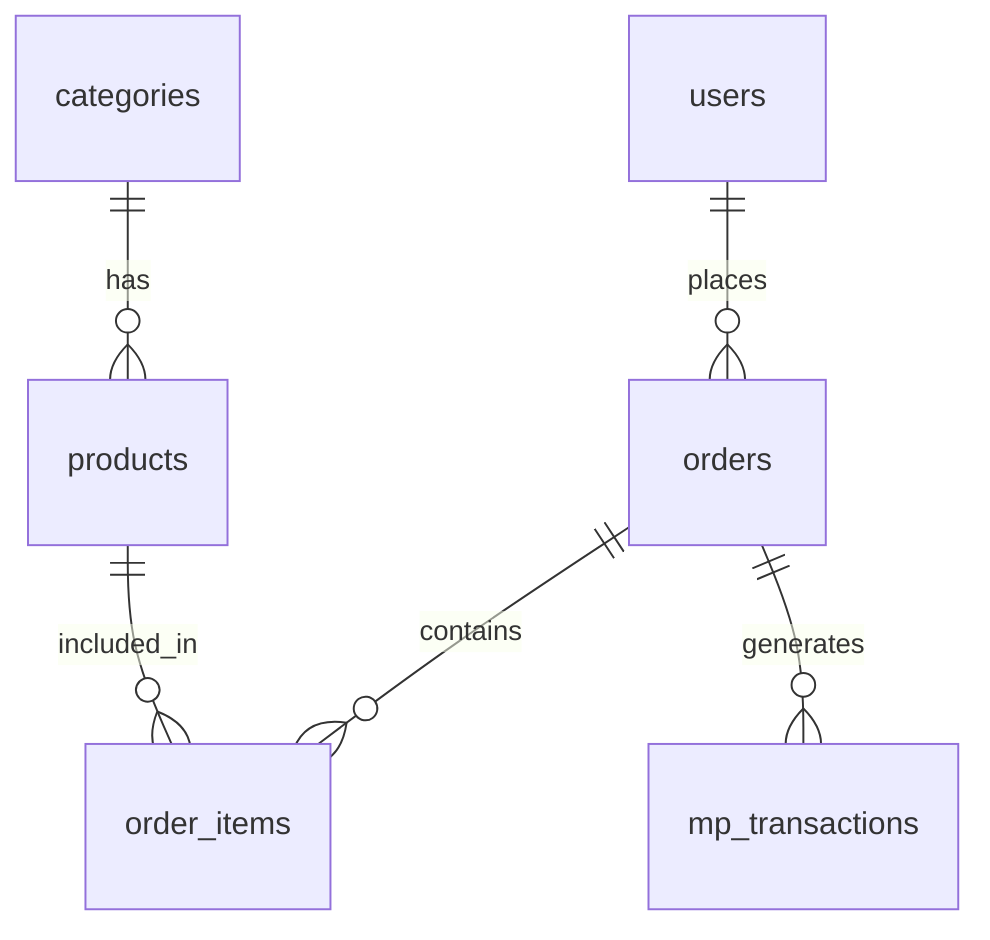

# Configuração do Supabase - PDV Auto Atendimento

## 📋 Pré-requisitos

1. Conta no [Supabase](https://supabase.com)
2. Node.js instalado
3. Projeto clonado localmente

## 🚀 Configuração Inicial

### 1. Criar Projeto no Supabase

1. Acesse [supabase.com](https://supabase.com)
2. Clique em "Start your project"
3. Crie uma nova organização (se necessário)
4. Clique em "New Project"
5. Configure:
   - **Name**: PDV Auto Atendimento
   - **Database Password**: Crie uma senha forte
   - **Region**: Brazil (South America)
6. Clique em "Create new project"

### 2. Obter Credenciais

Após a criação do projeto:

1. Vá em **Settings** → **API**
2. Copie as seguintes informações:
   - **Project URL**: `https://your-project.supabase.co`
   - **anon public key**: `eyJhbGciOiJIUzI1NiIsInR5cCI6IkpXVCJ9...`

### 3. Configurar Variáveis de Ambiente

1. Copie o arquivo `.env.example` para `.env`:
   ```bash
   cp .env.example .env
   ```

2. Edite o arquivo `.env` e adicione suas credenciais:
   ```env
   VITE_SUPABASE_URL=https://your-project.supabase.co
   VITE_SUPABASE_ANON_KEY=eyJhbGciOiJIUzI1NiIsInR5cCI6IkpXVCJ9...
   ```

### 4. Executar Migrações

1. No painel do Supabase, vá em **SQL Editor**
2. Clique em "New query"
3. Copie e cole o conteúdo do arquivo `supabase/migrations/001_initial_schema.sql`
4. Clique em "Run" para executar
5. Repita o processo para `supabase/migrations/002_rls_functions.sql`

### 5. Verificar Instalação

1. Execute o projeto:
   ```bash
   npm run dev
   ```

2. Acesse o painel administrativo em `/admin`
3. Verifique se consegue criar categorias e produtos

## 📊 Estrutura do Banco de Dados

### Tabelas Principais

- **categories**: Categorias de produtos
- **products**: Produtos do mercadinho
- **users**: Usuários (funcionários, moradores, clientes)
- **orders**: Pedidos realizados
- **order_items**: Itens dos pedidos
- **expenses**: Despesas do estabelecimento
- **mp_transactions**: Log de transações Mercado Pago
- **settings**: Configurações do sistema

### Relacionamentos



## 🔒 Segurança (RLS)

O Row Level Security está habilitado em todas as tabelas com políticas que permitem:

- **Leitura pública**: Para categorias e produtos (necessário para o PDV)
- **Acesso administrativo**: Para todas as operações de gerenciamento

### Configuração Futura de Autenticação

Para implementar autenticação administrativa:

1. Habilite autenticação por email no Supabase
2. Crie usuários administrativos
3. Atualize as políticas RLS para verificar `auth.uid()`

## 📝 Dados Iniciais

O sistema não vem com dados pré-populados. Para começar:

1. Acesse `/admin` (login: admin / admin123)
2. Vá em **Configurações** → **Categorias**
3. Crie suas categorias de produtos
4. Vá em **Produtos** e cadastre seus produtos
5. Configure usuários em **Usuários** para descontos

## 🔧 Manutenção

### Backup

O Supabase faz backup automático, mas você pode:

1. Exportar dados via SQL Editor
2. Usar a API para backup programático
3. Configurar webhooks para sincronização

### Monitoramento

1. **Dashboard**: Monitore uso no painel Supabase
2. **Logs**: Verifique logs de erro em **Logs** → **Database**
3. **Performance**: Monitore queries lentas

### Atualizações de Schema

Para mudanças no banco:

1. Crie nova migração em `supabase/migrations/`
2. Execute via SQL Editor
3. Teste em ambiente de desenvolvimento primeiro

## 🚨 Troubleshooting

### Erro de Conexão

```
Error: Missing Supabase environment variables
```

**Solução**: Verifique se as variáveis estão corretas no `.env`

### Erro de Permissão

```
Error: permission denied for table products
```

**Solução**: Verifique se as políticas RLS estão configuradas corretamente

### Tabelas não encontradas

```
Error: relation "products" does not exist
```

**Solução**: Execute as migrações SQL no painel do Supabase

### Performance Lenta

1. Verifique índices nas tabelas
2. Otimize queries complexas
3. Use paginação para listas grandes

## 📞 Suporte

- [Documentação Supabase](https://supabase.com/docs)
- [Discord Supabase](https://discord.supabase.com)
- [GitHub Issues](https://github.com/supabase/supabase/issues)

---

**✅ Checklist de Configuração**

- [ ] Projeto criado no Supabase
- [ ] Credenciais copiadas para `.env`
- [ ] Migrações executadas
- [ ] Conexão testada
- [ ] Categorias criadas
- [ ] Produtos cadastrados
- [ ] Usuários configurados
- [ ] Sistema funcionando

Após completar todos os itens, seu PDV estará pronto para produção!