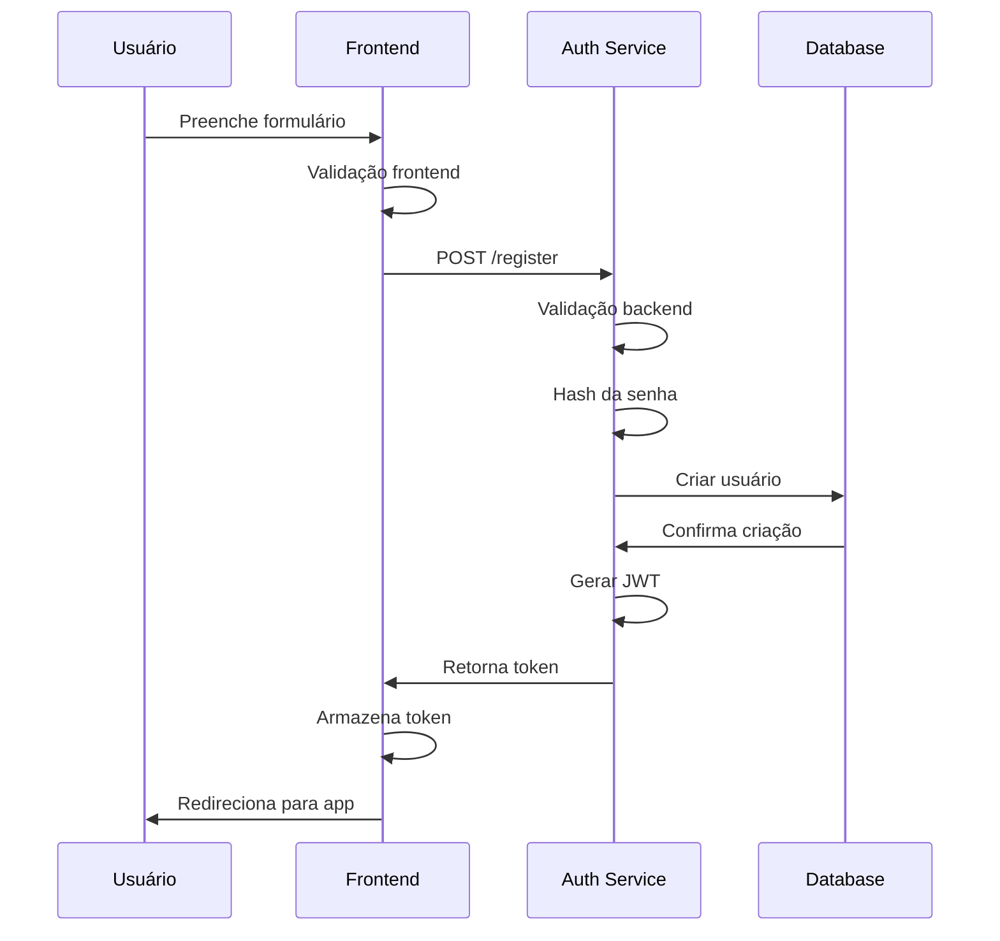
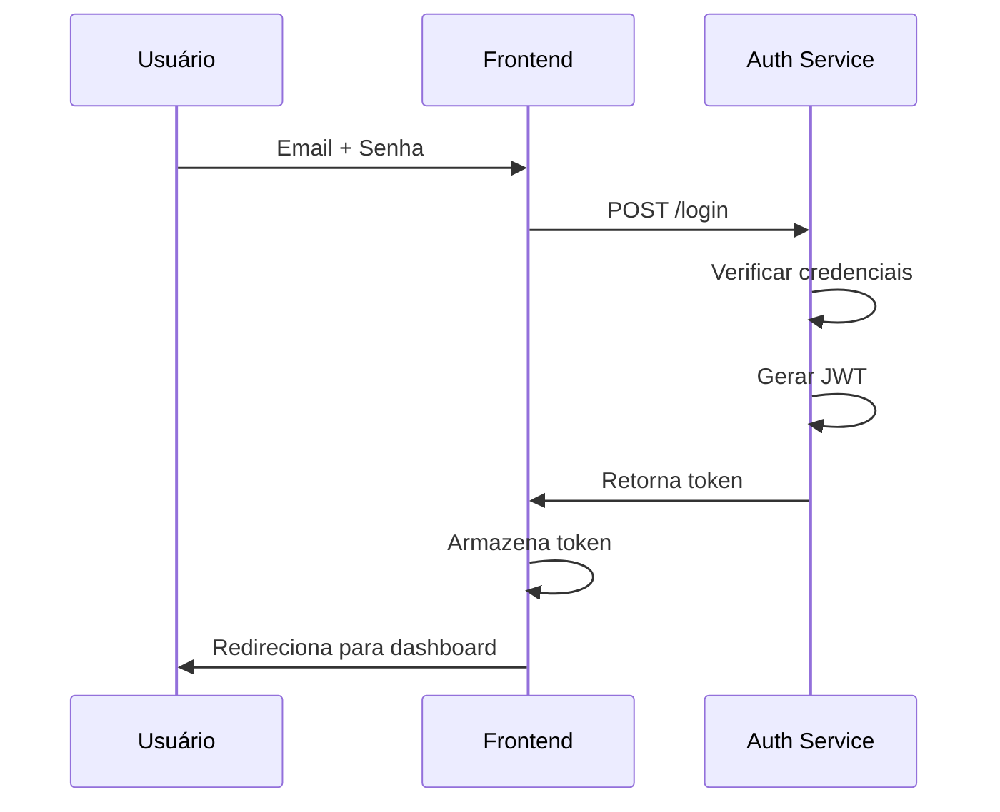
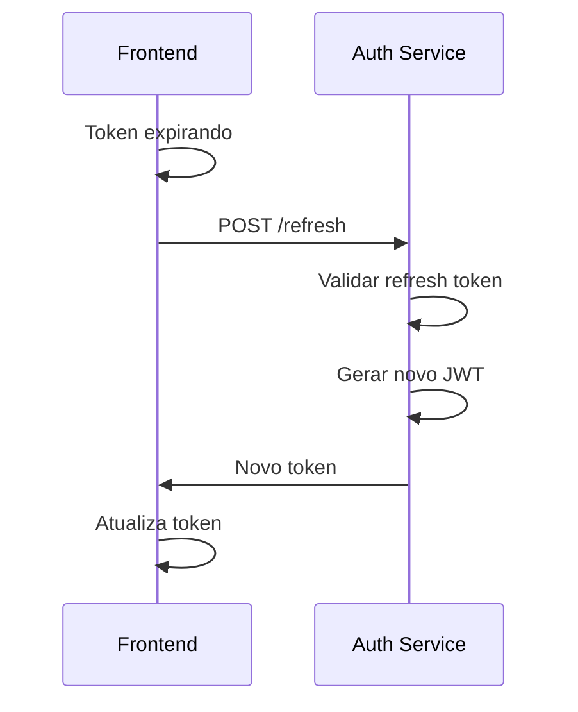

# Sistema de Autenticação

## Visão Geral

Documentação do sistema de autenticação da aplicação, incluindo estratégias de implementação, fluxos de segurança e melhores práticas.

## Status Atual

⚠️ **Não implementado** - Sistema de autenticação ainda não foi desenvolvido.

## Arquitetura Proposta

### Estratégias de Implementação

#### Opção 1: Supabase Auth (Recomendado)
```typescript
// Configuração do cliente Supabase
import { createClient } from '@supabase/supabase-js'

const supabase = createClient(
  process.env.REACT_APP_SUPABASE_URL!,
  process.env.REACT_APP_SUPABASE_ANON_KEY!
)

// Hook de autenticação
export const useAuth = () => {
  const [user, setUser] = useState(null)
  const [loading, setLoading] = useState(true)

  useEffect(() => {
    const { data: { subscription } } = supabase.auth.onAuthStateChange(
      (event, session) => {
        setUser(session?.user ?? null)
        setLoading(false)
      }
    )

    return () => subscription.unsubscribe()
  }, [])

  return { user, loading }
}
```

#### Opção 2: Firebase Auth
```typescript
// Configuração Firebase
import { initializeApp } from 'firebase/app'
import { getAuth } from 'firebase/auth'

const app = initializeApp(firebaseConfig)
export const auth = getAuth(app)
```

#### Opção 3: Auth0
```typescript
// Provider Auth0
import { Auth0Provider } from '@auth0/auth0-react'

<Auth0Provider
  domain="your-domain.auth0.com"
  clientId="your-client-id"
  redirectUri={window.location.origin}
>
  <App />
</Auth0Provider>
```

## Fluxos de Autenticação

### 1. Registro de Usuário


### 2. Login


### 3. Renovação de Token


## Implementação Frontend

### Context de Autenticação
```typescript
// contexts/AuthContext.tsx
interface AuthContextType {
  user: User | null
  login: (email: string, password: string) => Promise<void>
  register: (email: string, password: string) => Promise<void>
  logout: () => void
  loading: boolean
}

export const AuthContext = createContext<AuthContextType | undefined>(undefined)

export const AuthProvider: React.FC<{ children: ReactNode }> = ({ children }) => {
  const [user, setUser] = useState<User | null>(null)
  const [loading, setLoading] = useState(true)

  const login = async (email: string, password: string) => {
    setLoading(true)
    try {
      const { data } = await authService.login({ email, password })
      setUser(data.user)
      localStorage.setItem('token', data.token)
    } catch (error) {
      throw error
    } finally {
      setLoading(false)
    }
  }

  const logout = () => {
    setUser(null)
    localStorage.removeItem('token')
  }

  return (
    <AuthContext.Provider value={{ user, login, register, logout, loading }}>
      {children}
    </AuthContext.Provider>
  )
}
```

### Hook Personalizado
```typescript
// hooks/useAuth.ts
export const useAuth = (): AuthContextType => {
  const context = useContext(AuthContext)
  if (!context) {
    throw new Error('useAuth must be used within AuthProvider')
  }
  return context
}
```

### Proteção de Rotas
```typescript
// components/ProtectedRoute.tsx
interface ProtectedRouteProps {
  children: ReactNode
  requiredRole?: string
}

export const ProtectedRoute: React.FC<ProtectedRouteProps> = ({ 
  children, 
  requiredRole 
}) => {
  const { user, loading } = useAuth()

  if (loading) return <LoadingSpinner />
  
  if (!user) {
    return <Navigate to="/login" replace />
  }

  if (requiredRole && !user.roles.includes(requiredRole)) {
    return <Navigate to="/unauthorized" replace />
  }

  return <>{children}</>
}
```

## Componentes de Interface

### Formulário de Login
```typescript
// components/LoginForm.tsx
export const LoginForm: React.FC = () => {
  const [email, setEmail] = useState('')
  const [password, setPassword] = useState('')
  const [loading, setLoading] = useState(false)
  const { login } = useAuth()

  const handleSubmit = async (e: React.FormEvent) => {
    e.preventDefault()
    setLoading(true)
    
    try {
      await login(email, password)
    } catch (error) {
      toast.error('Credenciais inválidas')
    } finally {
      setLoading(false)
    }
  }

  return (
    <form onSubmit={handleSubmit} className="space-y-4">
      <Input
        type="email"
        placeholder="Email"
        value={email}
        onChange={(e) => setEmail(e.target.value)}
        required
      />
      <Input
        type="password"
        placeholder="Senha"
        value={password}
        onChange={(e) => setPassword(e.target.value)}
        required
      />
      <Button type="submit" loading={loading}>
        Entrar
      </Button>
    </form>
  )
}
```

## Segurança

### Armazenamento de Tokens
```typescript
// utils/tokenStorage.ts
class TokenStorage {
  private readonly TOKEN_KEY = 'auth_token'
  private readonly REFRESH_KEY = 'refresh_token'

  setTokens(accessToken: string, refreshToken: string) {
    // HttpOnly cookie seria mais seguro
    localStorage.setItem(this.TOKEN_KEY, accessToken)
    localStorage.setItem(this.REFRESH_KEY, refreshToken)
  }

  getAccessToken(): string | null {
    return localStorage.getItem(this.TOKEN_KEY)
  }

  getRefreshToken(): string | null {
    return localStorage.getItem(this.REFRESH_KEY)
  }

  clear() {
    localStorage.removeItem(this.TOKEN_KEY)
    localStorage.removeItem(this.REFRESH_KEY)
  }
}
```

### Interceptador de Requisições
```typescript
// services/api.ts
const api = axios.create({
  baseURL: process.env.REACT_APP_API_URL,
})

// Request interceptor
api.interceptors.request.use((config) => {
  const token = tokenStorage.getAccessToken()
  if (token) {
    config.headers.Authorization = `Bearer ${token}`
  }
  return config
})

// Response interceptor
api.interceptors.response.use(
  (response) => response,
  async (error) => {
    if (error.response?.status === 401) {
      try {
        await refreshToken()
        return api.request(error.config)
      } catch {
        logout()
        window.location.href = '/login'
      }
    }
    return Promise.reject(error)
  }
)
```

## Tipos TypeScript

```typescript
// types/auth.ts
export interface User {
  id: string
  email: string
  name: string
  roles: string[]
  avatar?: string
  createdAt: string
  lastLogin?: string
}

export interface LoginRequest {
  email: string
  password: string
}

export interface RegisterRequest {
  email: string
  password: string
  name: string
}

export interface AuthResponse {
  user: User
  accessToken: string
  refreshToken: string
}
```

## Testes

### Testes do Hook useAuth
```typescript
// __tests__/useAuth.test.tsx
describe('useAuth Hook', () => {
  test('should login successfully', async () => {
    const { result } = renderHook(() => useAuth(), {
      wrapper: AuthProvider
    })

    await act(async () => {
      await result.current.login('test@test.com', 'password')
    })

    expect(result.current.user).toBeDefined()
    expect(result.current.user?.email).toBe('test@test.com')
  })

  test('should handle login error', async () => {
    const { result } = renderHook(() => useAuth(), {
      wrapper: AuthProvider
    })

    await expect(
      result.current.login('invalid@test.com', 'wrong')
    ).rejects.toThrow()
  })
})
```

## Configuração de Ambiente

```env
# .env
REACT_APP_SUPABASE_URL=https://your-project.supabase.co
REACT_APP_SUPABASE_ANON_KEY=your-anon-key

# ou Firebase
REACT_APP_FIREBASE_API_KEY=your-api-key
REACT_APP_FIREBASE_AUTH_DOMAIN=your-project.firebaseapp.com

# ou Auth0
REACT_APP_AUTH0_DOMAIN=your-domain.auth0.com
REACT_APP_AUTH0_CLIENT_ID=your-client-id
```

## Próximos Passos

1. [ ] Escolher provedor de autenticação
2. [ ] Implementar AuthContext
3. [ ] Criar componentes de login/registro
4. [ ] Implementar proteção de rotas
5. [ ] Configurar interceptadores de API
6. [ ] Adicionar testes de autenticação
7. [ ] Implementar recuperação de senha
8. [ ] Adicionar 2FA (opcional)

## Recursos Externos

- [Supabase Auth Documentation](https://supabase.com/docs/guides/auth)
- [Firebase Auth Guide](https://firebase.google.com/docs/auth)
- [Auth0 React SDK](https://auth0.com/docs/quickstart/spa/react)
- [JWT Best Practices](https://auth0.com/blog/a-look-at-the-latest-draft-for-jwt-bcp/)